# R2D2VaderBeef
Hi! I'm a Software Engineering student, undertaking a year-long work placement in the academic year 2026-27. 

- My main area of expertise is **web dev**, with my preferred tech stack being Node.js + Express.js on the backend.
  
- My favourite language is **JS** (who would have guessed?) though I also have experience with Python and Java.

- I'm learning **C** and **C++**!
### Stats

